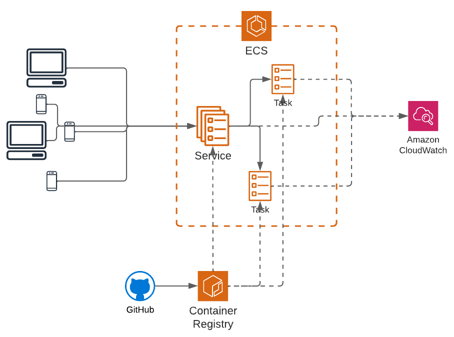
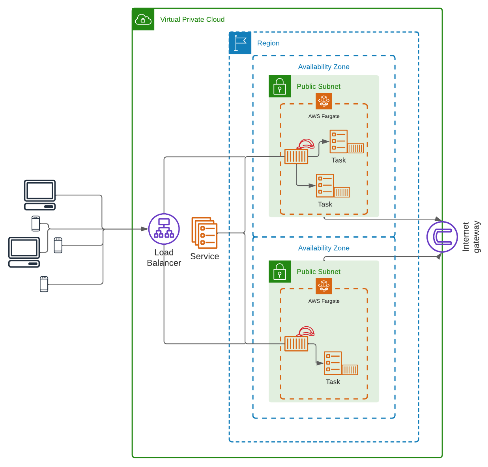

# ECS services and tasks tutorial

This project creates a sample infrastructure for an application
consisting of one API and one task. The API is hosted in AWS ECS,
launched in Fargate, with a load balancer directing its traffic, and the
tasks are run by the API, in AWS ECS, launched also on Fargate. All
resources are created in the same region, but the API has different
instances running in different availability zones. A high level diagram
of the aplication is presented:

And a more detailed view, describing the network:

This is not production-ready and would require a few security, as well
as performance improvements to be put in production, but it should give
you a nice starting point.

Infrastructure is described with [Terraform](https://www.terraform.io/),
and deploy is made with GitHub Actions. The following secrets must be
created:
- `AWS_ACCESS_KEY_ID`: access key of the "deploy user" created by the
project;
- `AWS_ACCOUNT_ID`: ID of your AWS account;
- `AWS_DEFAULT_REGION`: region where to deploy resources;
- `AWS_SECRET_ACCESS_KEY`: secret access key of the "deploy user"
created by the project;
